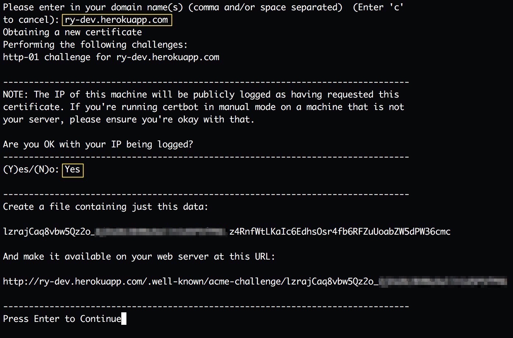

# 数字证书相关

### [数字证书原理](https://zhaohuabing.com/post/2020-03-19-pki/)

#### 非对称加密

- 对称加密中加密和解密是用同样的密钥。


- 非对称加密中有公钥(public key)和私钥(private key)，成对出现的。用一个加密需要用另外一个才能解密。


- openssl 创建密钥对

```shell
# generate private key => private_key.pem
openssl genpkey -algorithm RSA -outform PEM -out private_key.pem

# generate corresponding public key, private_key.pem => public_key.pem
openssl rsa -in private_key.pem -outform PEM -pubout -out public_key.pem

# test input file => plain_text
echo 'Hello world' > plain_text

# encrypt plain_text with public key, public_key.pem + plain_text => encrypted_text
openssl rsautl -encrypt -inkey public_key.pem -pubin -in plain_text -out encrypted_text

# decrypt with private key, private_key.pem + encrypted_text => decrypted_text
openssl rsautl -decrypt -inkey private_key.pem -in encrypted_text -out decrypted_text

# check the difference
diff plain_text decrypted_text
```


#### 哈希函数 (hash)

哈希函数对任意长度的输入，得到固定长度的二进制数据。md5、SHA1和SHA256是典型的哈希函数。

用于加密的哈希函数需要满足一些特征：

- 无法找到相同输出的输入。
- 无法由输入反推输入。

我们对一段数据应用哈希函数可以得到这段数据的摘要(digest)。

#### 数字签名 (signature)

对 digest 用**私钥**加密得到这对数据的<u>数字签名</u>(signature)，这个过程叫 signing。

将数据和数据的signature一起发送给对方，对方用<u>公钥</u>解密得到digest，通过验证数据的digest是否相同就知道数据是否篡改过。这个过程是verification。

同时这个过程也说明这个人控制了公钥的对应私钥。因此公钥可以当作一个身份标识。


#### 数字证书

对个人或者组织的身份信息（例如公钥/姓名/地址/电子邮箱等）做数字签名就可以得到数字证书。

这个过程的薄弱处在发送方和接收方上，双方需要保管好对应的私钥和公钥。

- 发送放Bob的私钥泄露，用这个私钥对篡改过的数据发送给接收方Susan。
- 接收方Susan的公钥被替换，接收方以为安全地得到了正确的信息。

所以引入了数字证书认证机构 CA (Certificate Authority)。

生成数字证书时会使用证书颁发机构（Issuer）的私钥对证书内容（证书拥有者的公钥和身份信息）进行数字签名。

RFC5280 定义的x.509公钥证书格式：


```shell
# 需要填入基本的身份信息
# 生成 key.pem 和 certificate.pem, certificate.pem是公钥
openssl req -newkey rsa:2048 -nodes -keyout key.pem -x509 -days 365 -out certificate.pem

# 查看证书文件内容
openssl x509 -in certificate.pem -text
# 其中 begin certificate 和 END CERTIFICATE 之间的是 PEM 格式进行BASE64编码的原始证书文件内容。
```


##### 自签名证书

如果用到的私钥是证书内容公钥对应的私钥，则生成的证书是自签名证书。

查看上面生成的证书，Issuer和Subject是相同的，是自签名证书。

```shell
# 用certificate.pem验证证书certificate.pem
openssl verify -CAfile certificate.pem certificate.pem
```


##### 证书机构 (CA)

可信任的第三方机构的私钥来签发证书。

CA是自签名的根证书。

在chrome://settings/security 的 manage certificates中可以查看内置的根证书。


##### 证书链

CA用根证书签发中间证书（intermediate certificate），由中间证书来签发用户证书。

中间证书可以由多个层级，形成了证书链。

##### 交叉认证

多个CA可以为同一个公钥签发证书，所以一个证书签名对应的公钥可以在多个上级证书中。

## Let's Encrypt

申请证书需要验证域名是你控制的。

验证域名的三种模式：HTTP(http-01), DNS(dns-01), TLS(tls-alpn-01)

HTTP模式下, Let's Encrypt 会产生随机字符串，我们需要在WEB服务器的 `/.well-known/acme-challenge/`路径下放置该字符串命名的文件。Let's Encrypt 能访问该文件，证明我们是域名的实际控制者。

DNS模式也是产生随机字符串，我们以该字符串建立一个DNS TXT记录，Let's Encrypt查询域名的TXT记录验证。

TLS-SNI模式 (TODO)

我们可以在任意电脑上验证域名，申请完成后将证书复制到服务器上。

通配符证书需要DNS模式验证。

[手动签发](https://jingsam.github.io/2018/10/12/lets-encrypt.html)

TODO 如何给内网的签发证书？

- 简单点的：

```shell
certbot certonly --standalone -d myminio.com --staple-ocsp -m test@yourdomain.io --agree-tos
```

- 手动签发，根据要求填入信息

```shell
certbot certonly --manual
# 到下面步骤时候不要 Enter 继续
```



- 可以在当前目录起一个静态文件服务器

```shell
mkdir -p .well-know/acme-challenge/
echo <content> > .well-known/acme-channelge/<file-name>
python -m http.server 80
```

- `/etc/letsencrypt/archive/ry-dev.herokuapp.com` 目录下会生成相关的文件

```
cert.pem # certificate
chain.pem # The Let's Encrypt "chain" certificate that needs to be installed with
          # the private domain certificate
fullchain.pem # concattention of cert.pem and chain.pem
              # This is because some implementations (such as Apache >= 2.4.8) will need
              # the chain certificate in the same file as the leaf certificate.
privkey.pem # private key file
```

- flask demo

```python
#!/usr/bin/env python
# coding: utf8

import flask

app = flask.Flask(__name__)

@app.route('/', methods=['GET'])
def serve():
    return "Hello, world!", 200

# flask run -h 0.0.0.0 -p 4430 --cert fullchain.pem --key privkey.pem
```

注意我们并没有用标准端口443，浏览器是可以正确访问的。

也可以用如下命令验证:

```shell
openssl s_client -quiet -connect ry-dev.herokuapp.com:4430
```

Let's Encrypt only signs end leaf certificates, i.e., the chain of trust ends there.


#### [ACME V2(RFC 8555) 协议](https://zhuanlan.zhihu.com/p/75032510)

[how-plex-is-doing-https-for-all-its-users](https://blog.filippo.io/how-plex-is-doing-https-for-all-its-users/)

[acme-dns](https://github.com/joohoi/acme-dns)

https://letsencrypt.org/certificates/

https://github.com/acmesh-official/acme.sh

https://letsencrypt.org/zh-cn/docs/client-options/

------

[getting-valid-ssl-certificate-for-localhost-from-letsencrypt](https://ritesh-yadav.github.io/tech/getting-valid-ssl-certificate-for-localhost-from-letsencrypt/)

```shell
cat privkey.pem cert.pem > myapp.pem
```

访问 https://www.identrust.com/dst-root-ca-x3 的内容，复制到 IdenTrustCA.crt

```shell
openssl x509 -in IdenTrustCA.crt -out IdenTrustCA.pem -outform PEM
cat IdenTrustCA.pem chain.pem > ca.pem
openssl verify -CAfile ca.pem myapp.pem
```

------

### 整个过程的模拟

#### 背景

假设Alice要发送一个电子商务合同给Bob，为了让Bob表明合同是Alice发送的，Alice使用自己的证书对该合同进行数字签名后再发送，证书的签发、使用和验证过程如下图：


0. CA 自签名

1. Alice在本地生成Private Key和CSR（Certificate Signing Request）。CSR中包含了Alice的公钥和姓名，机构、地址等身份信息。
2. Alice使用该CSR向证书机构发起数字证书申请。
3. 证书机构验证Alice的身份后，使用CSR中的信息生成数字证书，并使用自己的CA根证书对应的私钥对该证书签名。
4. Alice使用自己的Private Key对合同进行签名，然后将签名后的合同和自己的证书一起并发送给Bob。
5. Bob使用操作系统中自带的证书机构根证书中的公钥来验证Alice证书中的签名，以确认Alice的身份和公钥。
6. Alice的证书验证成功后，Bob使用Alice证书中的公钥来验证合同中数字签名。
7. 合同数字签名通过验证，可以证明该合同为Alice本人发送，并且中间未被第三方篡改过。

```shell
# 模拟CA：创建私钥和自签名的根证书 
# => rootCA.key, rootCA.crt
# -x509 会生成 self signed certificate，否则得到的是 certificate request
openssl req -newkey rsa:2048 -nodes -keyout rootCA.key -x509 -days 365 -out rootCA.crt

# 创建Alice的私钥和CSR(证书签名请求)
# 该CSR中包含了Alice的私钥对应的公钥，以及Alice的姓名，机构等身份信息。
# => Alice.key, Alice.csr (certificate signing request)
openssl req -new -nodes -keyout Alice.key -out Alice.csr

# 使用证书机构的私钥、根证书和Alice的CSR为Alice创建数字证书。
# => Alice.crt
openssl x509 -req -in Alice.csr -CA rootCA.crt -CAkey rootCA.key -CAcreateserial -out Alice.crt

# Alice使用私钥对商业合同签名，然后把签名后的合同和Alice的数字证书一起发给Bob。
echo "A very important business contract to Bob" > alice-contract
openssl dgst -sha256 -sign Alice.key -out alice-contract-sign.sha256 alice-contract

# Bob收到该合同后，需要先验证Alice的数字证书是否合法。
# 验证失败：签发Alice证书的的根证书是由我们生成的一个自签名证书，不是内置在操作系统内的权威机构的根证书。
openssl verify Alice.crt

# 验证Alice证书的命令行中指定证书机构的根证书
# 验证成功
openssl verify -CAfile rootCA.crt  Alice.crt

# 在正常情况下，该根证书应该是内置在操作系统中的

# 通过命令把该证书导入到系统中，以模拟内置证书的情况; Arch Linux 命令如下
sudo cp rootCA.crt /etc/ca-certificates/trust-source/anchors/
sudo trust extract-compat

# 不指定根证书也可以验证成功，因为验证时默认使用操作系统中内置的证书
openssl verify Alice.crt

# 在验证了Alice的证书后，使用Alice的证书中的公钥对合同的电子签名进行验证，以证明该合同的确是由Alice发出的。

# 从Alice的证书中导出Alice的公钥
openssl x509 -pubkey -noout -in Alice.crt  > Alice-pub.key

# 使用公钥对合同签名进行验证
openssl dgst -sha256 -verify Alice-pub.key -signature alice-contract-sign.sha256 alice-contract
```

